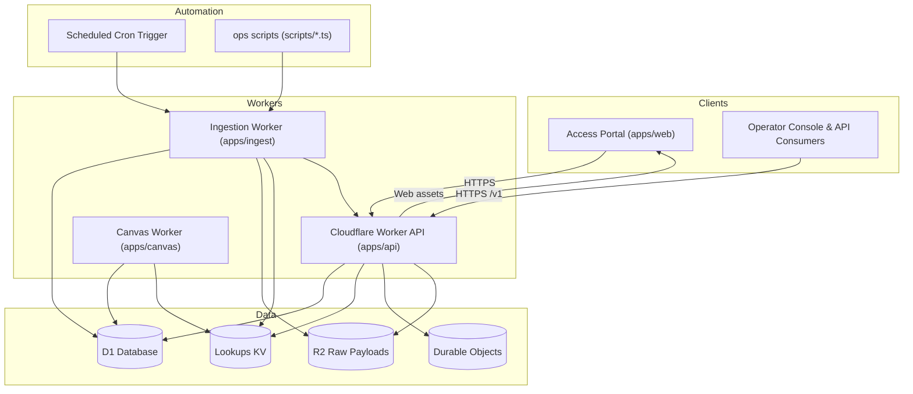

# System Architecture

This document describes how the gov-programs-api platform is assembled across Workers, client assets,
persistence layers, and background automation.

## Component Responsibilities

| Area | Source | Responsibilities |
| --- | --- | --- |
| Access portal | `apps/web` | Svelte SPA for signup and playbook surface |
| API Worker | `apps/api` | Hono router exposing `/v1` program search, stacks, metrics, operator console |
| Canvas Worker | `apps/canvas` | Collaborative canvas & onboarding flows for internal users |
| Ingestion Worker | `apps/ingest` | Fetches catalog sources, stores normalized programs, computes coverage |
| Automation scripts | `scripts/` | Local/CI helpers for setup, deploy, ingestion, post-deploy validation |
| Persistence | `migrations/`, `packages/db` | D1 schema, Drizzle bindings, migration history |
| Datasets & docs | `data/`, `docs/` | Source registry, research artifacts, schema docs |

## Deployment Flow

1. `bun run setup:*` renders environment-specific `wrangler.toml` (local vs remote) and builds the web bundle.
2. `bun run deploy` uploads the worker, durable objects, and static assets via Wrangler.
3. Scheduled cron triggers and operator scripts execute ingestion to keep `programs`, `macro_metrics`, and other playbook tables fresh.
4. Playbook generation layers compose data from D1 and snapshots into country or region-specific outputs exposed through the API and web portal.

## Maintenance Checklist

- Update this diagram whenever we add a new Worker, background job, or persistence layer.
- Align any new directories or micro-services with the table above and link them from the relevant README files.
- Keep the source registry (`data/sources`) and migration history consistent with the components referenced here.
- Register research datasets in `apps/ingest/src/datasets/registry.ts` so ingestion captures `dataset_snapshots` and `dataset_services`; monitor and trigger reloads from the admin console.

## Dataset Automation

- `dataset_snapshots` and `dataset_services` track every research bundle registered in `apps/ingest/src/datasets/registry.ts`.
- `climate_country_metrics` and `climate_subnational_metrics` (migration `0017`) persist climate/ESG outputs from ND-GAIN, WRI Aqueduct, FEMA NRI, INFORM (global + subnational), Yale EPI, and UNEP freshwater statistics. Each run stores immutable snapshots plus source metadata for provenance.
- ISO-3166-2 crosswalks generated from research CSVs backfill province/state codes so that subnational feeds (Aqueduct, INFORM, UNEP, FEMA) share the same identifiers.
- Dataset generators pull subdivision metadata directly from Wikidata (with local overrides for GAUL/NUTS codes) via `bun run datasets:build`, ensuring crosswalks stay current without manual CSV edits.
- Admin console surfaces `/v1/admin/climate`, rendering ND-GAIN/INFORM/EPI/UNEP summaries alongside dataset health, while `/v1/playbooks/:country` now exposes climate metrics for downstream playbook clients.
- Generator scripts under `scripts/` emit TypeScript bundles from raw research assets (`datasets:build` now also includes `generate-climate-metrics-dataset.ts`). Cloudflare cron executes the ingestion worker, keeping TechLand, CognitiveOS, macro metrics, government programs, and climate-risk feeds synchronized.
