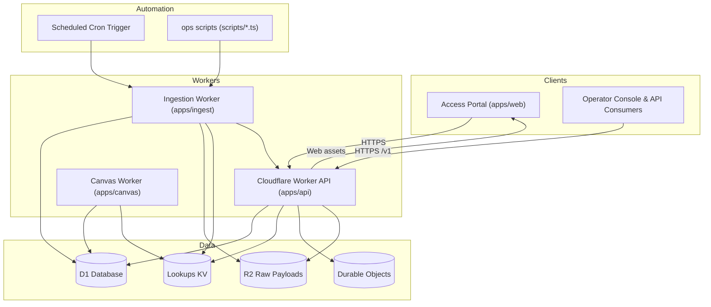

# System Architecture

This document describes how the gov-programs-api platform is assembled across Workers, client assets,
persistence layers, and background automation.

## Component Responsibilities

| Area | Source | Responsibilities |
| --- | --- | --- |
| Access portal | `apps/web` | SvelteKit app with marketing surface plus secure AppShell (TopBar, SideNav, CommandPalette) for operator tooling |
| API Worker | `apps/api` | Hono router exposing `/v1` program search, stacks, metrics, and the session-backed operator console (requests, feeds, schema browser, observability dashboards) |
| Canvas Worker | `apps/canvas` | Collaborative canvas & onboarding flows for internal users |
| Ingestion Worker | `apps/ingest` | Fetches catalog sources, stores normalized programs, computes coverage |
| Automation scripts | `scripts/` | Local/CI helpers for setup, deploy, ingestion, post-deploy validation |
| Persistence | `migrations/`, `packages/db` | D1 schema, Drizzle bindings, migration history |
| Datasets & docs | `data/`, `docs/` | Source registry, research artifacts, schema docs |
| UI primitives | `packages/atlas-tokens`, `packages/atlas-svelte` | Atlas design tokens, Tailwind preset, and Svelte primitives consumed by web clients |

### Atlas UI Foundation

- `packages/atlas-tokens` defines the unified design token source (`tokens.json`) and Bun build pipeline emitting CSS variables, Tailwind preset, and TypeScript contracts for downstream packages.
- `packages/atlas-svelte` ships Atlas primitives alongside the new `AtlasReportCard` and `AtlasEvidenceBlock` components used across capital and partner insights.
- `apps/web/src/lib/layout/AppShell.svelte` composes the responsive navigation shell (TopBar, SideNav, CommandPalette) shared by `/discover`, `/capital`, `/partners`, and future operator routes.
- Sample data for capital programs and partner profiles lives under `apps/web/src/lib/data`, enabling Sprint 1 report cards and evidence previews without backend dependencies.
- Sprint 2 prerequisites: land the Playwright CI container story (official Docker image, artifacts, trace-on-retry) and align `/v1/programs` query parameters with the upcoming capital finder filters before attaching live data.

## Database Tooling

- Drizzle ORM (`packages/db/src/schema.ts`) is the typed source of truth for D1 tables consumed by Workers and automation.
- `bun run db:generate` runs `drizzle-kit` to emit SQLite migrations into `migrations/`, keeping SQL history aligned with the schema.
- `bun run db:check` lints the schema and pending migrations during CI before we ship new storage changes.

## Deployment Flow

1. `bun run setup:*` renders environment-specific `wrangler.toml` (local vs remote) and builds the web bundle.
2. `bun run deploy` uploads the worker, durable objects, and static assets via Wrangler.
3. Scheduled cron triggers and operator scripts execute ingestion to keep `programs`, `macro_metrics`, and other playbook tables fresh.
4. Playbook generation layers compose data from D1 and snapshots into country or region-specific outputs exposed through the API and web portal.

## Maintenance Checklist

- Update this diagram whenever we add a new Worker, background job, or persistence layer.
- Align any new directories or micro-services with the table above and link them from the relevant README files.
- Keep the source registry (`data/sources`) and migration history consistent with the components referenced here.
- Register research datasets in `apps/ingest/src/datasets/registry.ts` so ingestion captures `dataset_snapshots` and `dataset_services`; monitor and trigger reloads from the admin console.

## Dataset Automation

- `dataset_snapshots` and `dataset_services` track every research bundle registered in `apps/ingest/src/datasets/registry.ts` and power the `/v1/operator/feeds` console dashboard (history, services, manual reloads).
- `climate_country_metrics` and `climate_subnational_metrics` (migration `0017`) persist climate/ESG outputs from ND-GAIN, WRI Aqueduct, FEMA NRI, INFORM (global + subnational), Yale EPI, and UNEP freshwater statistics. Each run stores immutable snapshots plus source metadata for provenance. (Germanwatch Climate Risk Index remains pending—reports are PDF-only and require licensing approval before automation.)
- ISO-3166-2 crosswalks generated from research CSVs backfill province/state codes so that subnational feeds (Aqueduct, INFORM, UNEP, FEMA) share the same identifiers.
- Dataset generators pull subdivision metadata directly from Wikidata (with local overrides for GAUL/NUTS codes) via `bun run datasets:build`, ensuring crosswalks stay current without manual CSV edits.
- Admin console surfaces `/v1/admin/climate`, rendering ND-GAIN/INFORM/EPI/UNEP summaries alongside dataset health, while `/v1/playbooks/:country` now exposes climate metrics for downstream playbook clients.
- Review licensing and redistribution constraints in `docs/LICENSING.md` (with the structured matrix at `data/dataset_license_matrix.csv`) before adding or modifying any external dataset ingestion.
- `esg_indicator_metadata` and `esg_country_metrics` capture World Bank WDI/WGI indicators and OECD AIR_GHG greenhouse-gas series; ingestion fetches the live APIs, normalises values, and persists metadata for attribution.
- Climate backlog includes: automating INFORM subnational downloads (HDX credential workflow), ingesting FEMA NRI tract-level + hazard-specific metrics, building support for WorldRiskIndex once HDX access is in place, and standing up the long-format `climate_hazard_metrics` table proposed in the INFORM/NRI deep-dive.
- Government-programs backlog includes: expanding beyond the initial US/CA/GB/FR/PE/SE/LA program set (state/district incentives, EU/APAC feeds), layering application calendars/monitoring jobs, validating lower-tier boundary changes (e.g., England 2024 reorg), and linking programs to capital-stack entities for blended-finance tooling.
- Generator scripts under `scripts/` emit TypeScript bundles from raw research assets (`datasets:build` now also includes `generate-climate-metrics-dataset.ts`). Cloudflare cron executes the ingestion worker, keeping TechLand, CognitiveOS, macro metrics, government programs, and climate-risk feeds synchronized.
